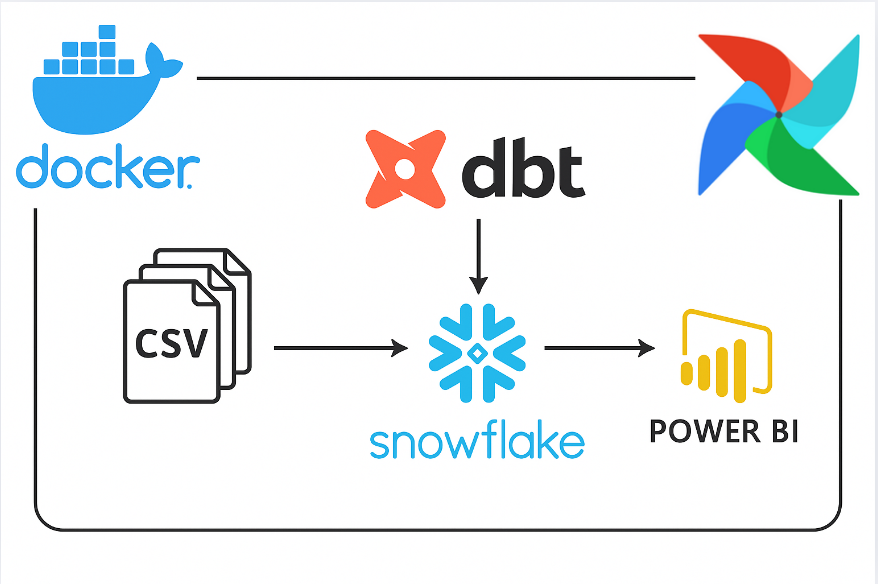

# 🚀 Modern Data Engineering Pipeline Project

<p align="center">
  
</p>

---

## 📌 Overview

This project showcases a modern **Data Engineering** pipeline built using:

- 🌨️ **Snowflake** – Cloud data warehouse  
- 🛠️ **dbt (Data Build Tool)** – Data transformation and modeling  
- 🕸️ **Apache Airflow** – Workflow orchestration using **CeleryExecutor**  
- 📊 **Power BI** – Data visualization and dashboards  
- 🐳 **Docker** – Environment containerization

### 📁 Input Data

The project uses the following CSV files:

- `orders.csv`  
- `order_items.csv`  
- `products.csv`  
- `customers.csv`

These are uploaded to a Snowflake internal stage (`sales_stage`) and processed into a structured data model via dbt.

---

## 🗂️ Project Structure

```bash
.
├── Dockerfile
├── docker-compose.yml
├── .env
├── dags/
│   └── dbt_dag.py
├── dbt/
│   ├── dbt_project.yml
│   ├── profiles.yml
│   └── models/
│       ├── staging/
│       │   ├── stg_customers.sql
│       │   ├── stg_orders.sql
│       │   ├── stg_order_items.sql
│       │   └── stg_products.sql
│       └── marts/
│           ├── Countries_Quantities.sql
│           ├── Customer_Segmentation.sql
│           ├── Daily_Order_Revenue.sql
│           └── Status_Order_Count.sql
├── tests/
│   └── snowflake_test.yml
├── airflow_cfg/
├── airflow_db/
│   └── airflow.db


```

⚙️ Tech Stack
🔧 Tool	💼 Purpose
Snowflake	Cloud Data Warehouse
dbt	Data Modeling & Transformation
Apache Airflow	Workflow Orchestration
Power BI	Business Intelligence & Dashboard
Docker	Containerized Development

❄️ Snowflake Workflow
📤 Upload CSVs to sales_stage (internal stage)

🧱 Create raw tables: customers, orders, order_items, products

📥 Load data with COPY INTO

🔄 Transform using dbt staging models

🧮 Create final marts models for analytics

🧱 dbt Models
🔹 Staging Models (models/staging/)
stg_customers.sql

stg_orders.sql

stg_order_items.sql

stg_products.sql

➡️ These clean, standardize, and prepare raw Snowflake data.

🔸 Mart Models (models/marts/)
Countries_Quantities.sql: 📦 Product quantities per country

Customer_Segmentation.sql: 👥 Customer classification

Daily_Order_Revenue.sql: 📈 Daily revenue trends

Status_Order_Count.sql: 📊 Order status breakdown

✅ dbt Testing (tests/snowflake_test.yml)
✔️ Validates order_status values (Completed, Pending, Cancelled)

✔️ Enforces uniqueness of customer_id in stg_customers

⏰ Airflow Integration
Airflow orchestrates dbt model runs using:

Webserver, Scheduler, Worker & Flower

DAG File: dags/dbt_dag.py

Executor: CeleryExecutor

🔁 Start Airflow
bash
Copy
Edit
docker-compose up airflow-init   # Run once
docker-compose up                # Start services
🌐 Access UI: http://localhost:8081

📊 Power BI Dashboard
After dbt materializes models in Snowflake:

🧩 Connect Power BI using native Snowflake connector

📥 Import tables/views like:

daily_order_revenue

customer_segmentation

status_order_count

countries_quantities

🖼️ Build dashboards with:

📈 Revenue Trends

📊 Order Status Summary

🌍 Country-wise Product Quantities

👥 Customer Segments

🐳 Docker Setup
🏗️ Build & Run Containers
bash
Copy
Edit
docker-compose build
docker-compose up
🌐 Environment Variables (.env)
env
Copy
Edit
POSTGRES_USER=airflow
POSTGRES_PASSWORD=airflow
POSTGRES_DB=airflow
📝 Notes
✅ Ensure Snowflake credentials are set in profiles.yml

📂 Run dbt commands from /opt/airflow/dbt inside the container

🔁 dbt automatically manages lineage and model dependencies

🚀 Future Enhancements
✅ Integrate Great Expectations for data quality checks

📥 Automate file arrival triggers or API ingestion

🔄 Add CI/CD with GitHub Actions or Jenkins

